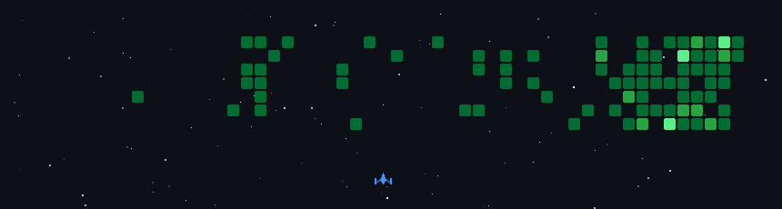

<div align="center">
  

  <br/>
  <br/>

  <a href="https://git.io/typing-svg">
    
  </a>

  <br/>

  [](https://moon-svg.minung.dev)

  <p align="center">
    <a href="https://blog.csdn.net/qq_15807167">
      
    </a>
    <a href="mailto:houshuai0816@gmail.com">
      
    </a>
  </p>
</div>

<div align="center">
  <h3>🚀 About Me</h3>
  <p>
    I am a passionate <strong>Full Stack Developer</strong> focusing on <strong>Distributed Systems</strong>, <strong>Mobile</strong>, and <strong>Web Technologies</strong>.<br/>
    I love building scalable applications and exploring new tech stacks.
  </p>
</div>

<br/>

<div align="center">
  <h3>🛠️ Skills Arsenal</h3>

  <table style="border: none; border-collapse: collapse;">
    <tr style="border: none;">
      <td align="center" style="border: none;">
        <strong>Languages</strong><br/><br/>
        
      </td>
      <td align="center" style="border: none;">
        <strong>Frontend & Mobile</strong><br/><br/>
        
      </td>
    </tr>
    <tr style="border: none;">
      <td align="center" style="border: none;">
        <strong>Backend & Cloud</strong><br/><br/>
        
      </td>
      <td align="center" style="border: none;">
        <strong>Tools & AI</strong><br/><br/>
        
        <br/>
        <br/>
        <!-- AI & Modern Editors -->
        
        
        
        
      </td>
    </tr>
  </table>
</div>

<br/>

<div align="center">
  <h3>📊 Coding Statistics</h3>

  <!--START_SECTION:waka-->

```txt
From: 03 February 2026 - To: 10 February 2026

TypeScript        27 hrs 33 mins  ████████████▓░░░░░░░░░░░░   50.10 %
Java              4 hrs 25 mins   ██░░░░░░░░░░░░░░░░░░░░░░░   08.04 %
SQL               3 hrs 17 mins   █▒░░░░░░░░░░░░░░░░░░░░░░░   05.99 %
Markdown          2 hrs 38 mins   █▒░░░░░░░░░░░░░░░░░░░░░░░   04.81 %
JSON              2 hrs 29 mins   █░░░░░░░░░░░░░░░░░░░░░░░░   04.54 %
```

<!--END_SECTION:waka-->
</div>

<br/>

<div align="center">
  <h3>🧩 Daily Dose of Fun</h3>
  
</div>

<br/>

<div align="center">
  <h3>📈 Activity Graph</h3>
  <a href="https://github.com/Ashutosh00710/github-readme-activity-graph">
    
  </a>
</div>



<br/>
<br/>

<div align="center">
  
</div>
